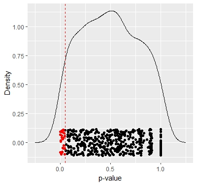

# Coins and Dice

The Coins 'n' Dice (coinsndice) R package simulates flipping coins and rolling dice in repeated sets, and
conducts statistical inference (proportions tests or t tests, and/or their associated confidence intervals)
on each set. This allows you to get a sense for p-values and endpoints of confidence intervals as random
variables.

To simulate coin flipping and die rolling, the `flip_coin` and `roll_die` functions can be used. However,
the main functions in the package are the `flip` and `roll` functions, which display (numerically and/or
graphically) the results of applying statistical inference repeatedly to simulated coin flips or die rolls.
In these functions, `n` is the number of flips or rolls per set, and `N` is the number of sets to be
simulated. Statistical inference (specified by other arguments to the functions) is conducted on each
set of flips and rolls.

For example, `roll(n=20, N=500, id="fair", null_value=3.5)` does the following:

1. Simulates rolling a fair die 20 times and conducting a one-sample *t*-test of whether the random variable mean of the die is 3.5,

2. Repeats that process a total of 500 times,

3. Computes some numerical summaries of the 500 resulting $p$-values, and

4. Makes a density plot of the 500 resulting $p$-values.

An example of a density plot produced this way is:

The `id` argument can be set to any other text string to simulate a die with unknown probabilities for each side; different values for `id` yield different probabilities for the sides of the die. Alternatively, `id` can be set to a numerical vector of length 6 (such as `c(0.1, 0.2, 0.3, 0.2, 0.1, 0.1)`) to specify the probabilities of the six sides explicitly. In short, by using the `id` argument, a die with either known or unknown probabilities can be used.

The `flip()` function works similarly. For more information on the functions `flip()` and `roll()`, see their respective help pages.

